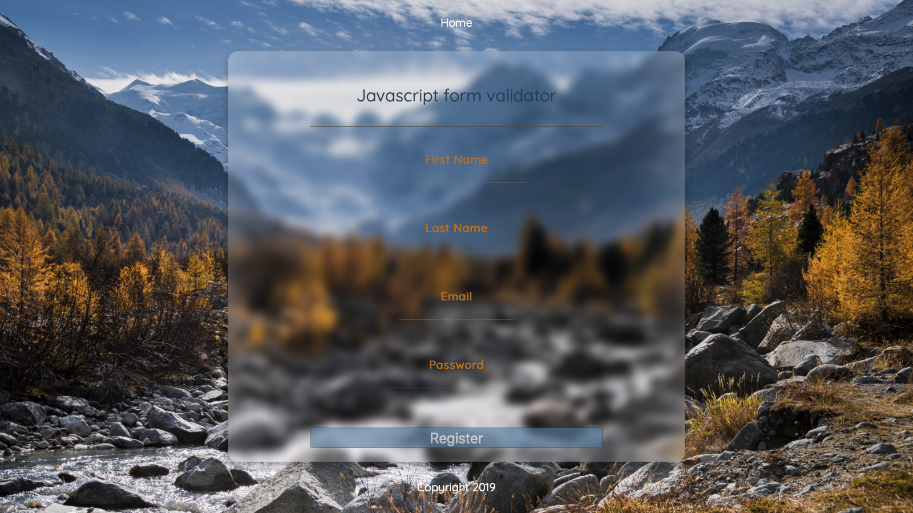

# Form Valid App
[Live App](https://form-validator3.netlify.com)

This is a simple user form that authenticates via vanilla JS with dynamic error messages.
Upon success authentication the user will be taken to a success page.

